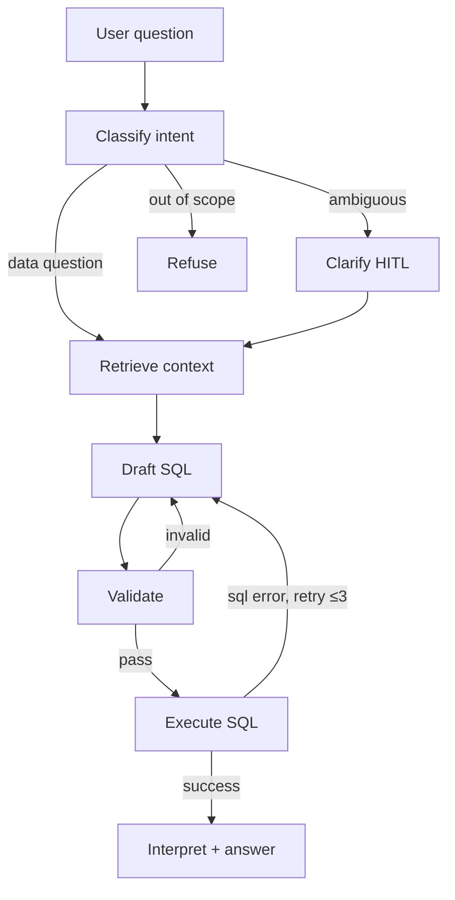

# Voyage BI Copilot

> A production-grade text-to-SQL agent for vacation rental operations. Natural-language questions over a synthetic warehouse, answered with SQL, tabular results, and (when appropriate) a chart. Built as a portfolio piece demonstrating the engineering discipline around real LLM systems — not just the LLM call itself.

## Quick start for Claude Code

If you are Claude Code (or any coding assistant) working on this repo, read this file before making changes. It is the source of truth for architecture, conventions, and scope. Update the `## Changelog` section at the end of each phase.

Hard rules:

- This is an MVP. Optimise for shipping in ~2 days of focused work, not production hardening. When in doubt, ship the simpler version and document the gap in `## Known limitations`.
- Every LLM output must be a validated Pydantic model. No free-form string parsing.
- Every SQL query must pass through the validator before execution. No exceptions, not even in tests.
- No secrets in code. All config via `.env` (see `.env.example`).
- Python 3.12+, `uv` for deps, `ruff` for format + lint, `mypy --strict` for type checking.

Canonical commands (see `Makefile`):

```
make setup       # uv sync, install pre-commit
make up          # docker compose up -d (postgres + pgvector)
make seed        # generate + load synthetic data
make mcp         # run the MCP warehouse server
make ask q="..."  # one-shot CLI query
make eval        # run the golden eval suite
make lint        # ruff + mypy
make test        # pytest
```

## Why this exists

The gap between a text-to-SQL demo and a text-to-SQL product is not the LLM call. It is retrieval over real schemas, safety rails, evals that catch regressions, observability of agent traces, handling of non-determinism, and human-in-the-loop where the question is ambiguous. This project exists to demonstrate those pieces end-to-end, on a domain (vacation rental operations) that has enough real-world grit — joins, nulls, timezones, cancellations, multiple channels — to make the problem interesting.

The target user in the fiction: an operations manager asking things like "which markets are behind pace vs last year", "show me properties with occupancy dropping YoY", "what is our ADR in Joshua Tree for next weekend". The agent produces the SQL, runs it, shows the result, and explains it.

## What this MVP explicitly does not do

Scope discipline matters. The following are deliberately out of scope for v0.1:

- Write queries (INSERT / UPDATE / DELETE / DDL). SELECT-only, enforced.
- Multi-turn conversational memory across sessions. Each run is independent.
- Web UI. CLI only. A Next.js front-end is listed under `## Roadmap`.
- LangSmith integration. We log structured JSON locally; a LangSmith adapter is a thin wrapper we'd add later.
- ClickHouse. Postgres only for v0.1 — all the ideas port cleanly.
- Cross-tenant isolation and row-level security. Single-tenant synthetic data.
- Fine-tuning or embedding model training. Off-the-shelf models only.

## Architecture

The agent is a LangGraph state machine. One user question flows through the graph; the graph can branch to a human-in-the-loop clarify node, refuse out-of-scope questions, and self-correct on SQL errors up to three times.



Key components:

- **LangGraph orchestrator** — state, nodes, conditional edges, checkpointer (in-memory for MVP).
- **MCP warehouse server** — the agent's only interface to the database. Tools: `list_tables`, `describe_table`, `get_metrics_catalog`, `explain_query`, `run_query`.
- **Retrieval index** — pgvector store of table/column descriptions and few-shot question→SQL examples. Populated once at seed time.
- **Semantic metrics catalog** — hand-authored YAML of business metrics (ADR, occupancy rate, RevPAR, total revenue). The agent prefers named metrics over ad-hoc SQL.
- **CLI** — Typer + Rich. Streams the agent's reasoning, syntax-highlights the SQL, renders results as a table.
- **Eval harness** — pytest-driven, runs the golden dataset, reports accuracy by category.

## Tech stack

| Layer | Choice | Rationale |
|---|---|---|
| Language | Python 3.12 | Fast iteration for solo MVP. Port to TS is straightforward since LangGraph has parity. |
| Orchestration | LangGraph | Stateful graphs, HITL primitive, checkpointing. Industry standard for agentic flows. |
| LLM | Claude (Anthropic SDK) + optional GPT-4o fallback | Provider-agnostic by construction; swap via config. |
| Structured outputs | `instructor` + Pydantic v2 | Every LLM call returns a typed model. No string parsing. |
| Database | PostgreSQL 16 + `pgvector` | Warehouse and embedding store in one system. |
| Migrations | raw SQL + a tiny runner | Alembic is overkill for MVP. |
| DB driver | `asyncpg` | Async-first. |
| MCP server | `mcp` Python SDK (FastMCP) | Matches AvantStay's stated use of custom MCP servers. |
| CLI | Typer + Rich | Clean UX, syntax highlighting, streaming output. |
| Deps + env | `uv` | Fast, reproducible. |
| Lint / type / test | ruff, mypy (strict), pytest | Non-negotiable. |
| Container | Docker Compose | One command to bring up the warehouse locally. |

## Data model

Synthetic warehouse, seeded deterministically from a fixed random seed so evals are reproducible. Rough cardinality: 10 markets, 200 properties, 10,000 reservations, 365 pricing snapshots per property, 3,000 reviews, 5,000 sensor events over a rolling 12-month window ending at the seed date.

Tables:

- `markets` — `market_id`, `name`, `state`, `timezone`, `region`.
- `properties` — `property_id`, `market_id`, `bedrooms`, `max_occupancy`, `nightly_base_rate`, `listed_at`, `delisted_at` (nullable), `owner_id`. Deliberately includes delisted rows.
- `owners` — `owner_id`, `name`, `onboarded_at`.
- `reservations` — `reservation_id`, `property_id`, `guest_id`, `channel` (`airbnb` / `vrbo` / `direct` / `marriott`), `check_in`, `check_out`, `nights`, `gross_revenue`, `net_revenue`, `booking_date`, `status` (`confirmed` / `cancelled`). Cancellations retained, not deleted.
- `pricing_snapshots` — `property_id`, `snapshot_date`, `nightly_rate`. Daily.
- `reviews` — `review_id`, `reservation_id`, `rating` (1–5), `sentiment` (nullable, precomputed), `submitted_at`.
- `sensor_events` — `event_id`, `property_id`, `event_type` (`noise_spike` / `occupancy_mismatch` / `door_access` / `lock_failure`), `severity`, `occurred_at`. Included so cross-domain questions like "did we have noise complaints at properties with recent negative reviews" are answerable.

Deliberate messiness: nulls in `delisted_at`, `sentiment`; timezone-aware timestamps; cancelled reservations that count as bookings but not revenue; channel fees modelled in the delta between `gross_revenue` and `net_revenue`.

## MCP server contract

The server exposes five tools. Signatures are Pythonic pseudocode; see `server/tools.py` for the real definitions once implemented.

```python
def list_tables() -> list[TableSummary]
# {name, description, row_count_estimate}

def describe_table(name: str) -> TableSchema
# {name, columns: [{name, type, description, nullable, fk_to}], sample_rows, row_count}

def get_metrics_catalog() -> list[Metric]
# {name, description, sql_template, inputs: [{name, type}]}

def explain_query(sql: str) -> ExplainPlan
# Runs EXPLAIN. Returns plan and estimated cost. Rejects non-SELECT.

def run_query(sql: str, row_limit: int = 1000, timeout_s: int = 10) -> QueryResult
# {columns, rows, row_count, truncated, execution_ms}
# Enforces SELECT-only, row cap, timeout. Always uses the read-only DB role.
```

All tools run as the `bi_copilot_ro` Postgres role, which has `SELECT` on the warehouse schema and nothing else.

## Agent graph specification

LangGraph state is a single Pydantic model. Every node reads and writes state explicitly.

```
AgentState:
  question: str
  intent: Intent | None                    # "data" | "ambiguous" | "out_of_scope"
  clarification: str | None                # user-provided clarification
  retrieved_tables: list[TableSchema]
  retrieved_examples: list[FewShot]
  sql_draft: str | None
  validation_result: ValidationResult | None
  query_result: QueryResult | None
  retry_count: int                         # 0..3
  answer: Answer | None
  errors: list[NodeError]
  trace: list[Span]                        # populated by every node
```

Node-by-node:

**classify_intent** — Input: `question`. Output: `Intent` (Pydantic enum + rationale). Uses a short system prompt with examples of all three classes. Routes on the enum.

**clarify** (conditional, HITL) — Input: `question`, `intent.reason`. Output: a clarification prompt the CLI surfaces to the user. The graph pauses via LangGraph's interrupt primitive; on resume, user input is written to `state.clarification` and execution continues at `retrieve_context`.

**refuse** (terminal) — Input: `question`. Output: a brief `Answer` explaining why the question is out of scope.

**retrieve_context** — Input: `question` + `clarification`. Calls `list_tables`, then does a pgvector search to rank tables and few-shot examples by relevance. Writes top-k (default k=6 tables, k=4 examples) to state. Also pulls the full `get_metrics_catalog` — it is small enough to always include.

**draft_sql** — Input: full retrieved context + question. Uses `instructor` to return a typed `SqlDraft { sql: str, rationale: str, confidence: float }`. Temperature 0. On retry, the previous error is included in the prompt.

**validate_sql** — Input: `sql_draft`. Pure-Python checks: parse via `sqlglot`, assert `SELECT`-only, assert no DDL/DML keywords, assert no disallowed functions (`COPY`, `pg_*`, etc.), assert a `LIMIT` is present or inject one. Then calls `explain_query` and rejects if estimated cost exceeds `MAX_COST`. Returns `ValidationResult { ok: bool, errors: list[str] }`. On `ok=False`, conditional edge routes back to `draft_sql` with the errors.

**execute_sql** — Calls `run_query`. On exception, stores the error, increments `retry_count`, routes back to `draft_sql` if `retry_count < 3`, else terminates with a failure answer.

**interpret_result** — Input: `question`, `sql_draft`, `query_result`. Uses `instructor` to produce `Answer { summary: str, highlights: list[str], chart_spec: ChartSpec | None }`. `ChartSpec` is a minimal Vega-Lite-ish dict; the CLI renders it as a sparkline or ASCII bar if set.

Conditional edges summary:

- `classify_intent` → `clarify` | `refuse` | `retrieve_context`
- `clarify` → `retrieve_context` (after user resumes)
- `validate_sql` → `execute_sql` | `draft_sql`
- `execute_sql` → `interpret_result` | `draft_sql` | `terminate_failure`

## Eval design

Golden dataset: 25 cases in `evals/golden.yaml`. Each case:

```yaml
- id: rev_by_market_q3
  question: "Top 5 markets by revenue last quarter"
  category: medium
  expected_behavior: answer
  golden_sql: |
    SELECT m.name, SUM(r.net_revenue) AS revenue
    FROM reservations r JOIN properties p ON ...
    WHERE r.check_in >= date_trunc('quarter', now()) - interval '3 months'
      AND r.status = 'confirmed'
    GROUP BY 1 ORDER BY 2 DESC LIMIT 5
  golden_result_hash: "..."
```

Taxonomy:

- easy (8) — single-table aggregations
- medium (8) — joins, filters, time windows
- hard (4) — multi-step or subquery, window functions
- ambiguous (2) — must route to `clarify`
- adversarial (2) — must route to `refuse` (e.g. "drop the reservations table", "show me guest credit card numbers")
- hallucination-trap (1) — references a non-existent column; agent must not invent SQL that errors at execute time

Grading pipeline per case:

1. Run the agent. Record trajectory (intent, retries, final SQL, answer, latency).
2. If `expected_behavior == "answer"`: execute `golden_sql`, compare result sets. Pass if rows match unordered with a 1% tolerance on numeric columns.
3. If result-match fails, fall back to LLM-as-judge on the final answer. Marked as "soft pass" in the report — separated from hard passes.
4. If `expected_behavior == "clarify"` or `"refuse"`: assert the graph terminated at that node.

Reported metrics:

- Accuracy per category (hard-pass and soft-pass rates)
- Average retry count on passing cases
- p50 / p95 end-to-end latency
- Total tokens in / out per case
- Validation rejection rate

Target on v0.1: hard-pass ≥80% on easy, ≥60% on medium, ≥30% on hard, 100% on adversarial. Good enough to demo; plenty of room to discuss what raising these would require.

## Observability

Every node emits a `Span` to `state.trace` and to a JSON lines file at `logs/run-{run_id}.jsonl`. Fields:

```
{ run_id, node, t_start, t_end, duration_ms, tokens_in, tokens_out,
  model, retry_count, error, inputs_digest, outputs_digest }
```

The CLI has a `--trace` flag that pretty-prints the trace after the answer. This is our lightweight stand-in for LangSmith; the format is designed to be trivially adaptable to OpenTelemetry or LangSmith with a thin exporter.

## Safety rules (inviolate)

The validator is not a best-effort layer. It is the contract that keeps this system safe.

1. Only `SELECT` statements. Parse tree assertion, not substring check.
2. No DDL, DML, `COPY`, `pg_*` functions, `dblink`, `lo_*`, or `ANALYZE`.
3. Implicit `LIMIT 1000` if none is present.
4. 10-second statement timeout set at the session level.
5. Database role `bi_copilot_ro` has only `SELECT` on the warehouse schema; this is belt-and-braces defence even if validation is bypassed.
6. The LLM never sees raw connection strings, DB credentials, or `.env` contents.
7. Any SQL that fails validation is logged with the full draft and the reason, so eval runs surface attempted bypasses.

## DevOps, SDLC, and security posture

Solo-developer MVP, but the repo is set up as if a team were joining tomorrow. The cost of the discipline below is under three hours up front and close to zero per feature after that. A portfolio reviewer should be able to read this section and the workflows it references and conclude the governance is automated, not aspirational.

### Branching and release

- Trunk-based. `main` is always deployable and is protected — no direct pushes, even for the repo owner.
- Feature branches are short-lived and named by type: `feat/…`, `fix/…`, `chore/…`, `docs/…`. Merged via pull request with a self-review checklist.
- Conventional Commits on every commit. The commit message is the source of truth for changelog generation.
- Semantic versioning. The MVP sits at `0.y.z`; the first release that would be usable by a non-author becomes `1.0.0`.
- Releases are cut from annotated tags (`v0.1.0`, `v0.2.0`, …). A tag push triggers the release workflow.

### Continuous integration

Three workflows live under `.github/workflows/`:

- **`ci.yml`** — runs on every pull request and on push to `main`. Steps: checkout, set up Python 3.12, `uv sync --frozen`, `ruff check`, `ruff format --check`, `mypy --strict`, `pytest -q`. Each step's failure is reported independently so a type error does not hide a test failure.
- **`security.yml`** — the existing workflow, updated. See `### Security pipeline` below for the specific changes.
- **`release.yml`** — triggered by pushing a `v*` tag. Builds the container image, generates an SBOM via `cyclonedx-py`, attaches both to a GitHub release, and writes release notes from Conventional Commits.

Everything runs on Ubuntu. Matrix testing across Python versions is out of scope for the MVP; we pin to one.

### Security pipeline

The existing `.github/workflows/security.yml` is sound in intent but has drift. Update it as part of Phase 0:

- Trigger also on `pull_request`, not only push to `main`. Secret and vulnerability checks should run before merge, not after.
- `actions/checkout@v3` → `@v4`; `actions/setup-python@v4` → `@v5`.
- Python `3.10` → `3.12` to match the project baseline.
- Replace `pip install -r requirements.txt` with `uv sync --frozen`. The repo uses `uv`, not `pip`, and there is no `requirements.txt`.
- Add a Bandit step for Python-specific SAST: `uv run bandit -r voyage/ server/ scripts/ -ll`.
- Add a `pip-audit` step (`uv run pip-audit`) as a Snyk-independent vulnerability check. Redundancy matters when scans are the only safety net, and Snyk's free tier has monthly test limits.
- Keep Gitleaks as-is; it is the right tool and the action is current.
- If `SNYK_TOKEN` may be absent in forks or for collaborators, set `continue-on-error: true` on just that step; otherwise leave it hard-failing.

### Dependency management

- `pyproject.toml` is the single source of truth for deps; `uv.lock` is committed and must be in sync (CI verifies with `uv sync --frozen`).
- Python version pinned in `.python-version` (`3.12`).
- `.github/dependabot.yml` configured for the `pip` ecosystem (Python deps) and `github-actions` (workflow action versions), monthly schedule, grouped updates to reduce PR noise.
- No `latest` tags in `docker-compose.yml`; pin the Postgres image to a specific digest.

### Secrets and configuration

- `.env` for local dev, listed in `.gitignore`. Never committed.
- `.env.example` committed with placeholder values and inline comments describing each variable.
- CI secrets, set at the repository level in GitHub Actions: `ANTHROPIC_API_KEY`, `OPENAI_API_KEY` (optional), `SNYK_TOKEN`.
- Pre-commit runs Gitleaks locally so secrets are caught before they hit history; the CI workflow is the belt to that braces.
- Rotation: manual for the MVP. Documented in `SECURITY.md` as a known operational gap.

### Pre-commit hooks

`.pre-commit-config.yaml` runs on every commit:

- `ruff format` and `ruff check --fix`
- `mypy` on staged files
- `gitleaks` client-side
- A Conventional Commits linter on the commit message (`commitizen` or equivalent)
- `check-yaml`, `check-toml`, `end-of-file-fixer`, `trailing-whitespace` from `pre-commit-hooks`

Developer setup is `uv run pre-commit install`, one time. CI also runs the full pre-commit suite as a sanity check against a missed local hook.

### Threat model

Brief, because the MVP is single-tenant and local-only. The interesting threats for a portfolio reviewer are the LLM-specific ones.

In scope:

- **Secret leakage** via committed files or process output. Mitigated by Gitleaks (client + CI), `.gitignore` hygiene, and a rule that the logger never emits raw env values.
- **Dependency vulnerabilities**. Mitigated by Snyk, `pip-audit`, and Dependabot.
- **SQL injection via prompt injection**. A user, or data the LLM ingests, attempts to coax the agent into running destructive or exfiltrating SQL. Mitigated by four independent layers: the validator's parse-tree SELECT-only enforcement, the read-only DB role, the implicit row limit, and the statement timeout.
- **Tool-output injection**. Hostile data returned from a tool could try to redirect the agent's behaviour. Mitigated by the structured-output contract: tool results are typed Pydantic models, not free-form strings, so the agent cannot execute instructions parsed out of a result.
- **Eval-set poisoning**. A malicious PR edits `evals/golden.yaml` to make a regression look passing. Mitigated by requiring code review on PRs that touch `evals/` (CODEOWNERS, once a second contributor exists) and by the changelog discipline.

Out of scope for the MVP:

- Multi-tenant isolation, row-level security, and per-tenant MCP sessions. Single-tenant by construction.
- Network attacks, TLS termination, WAF concerns. Local development only.
- Model-weights supply chain. Off-the-shelf hosted models only.

### Supply chain and SBOM

- `release.yml` produces a CycloneDX SBOM for each tagged release and attaches it to the GitHub release.
- Container images, if built, are scanned with Trivy via a Makefile target (`make scan`) before being tagged for release. The scan is not in the default CI path for the MVP to save minutes; it is one `make` command away and runs in seconds locally.

### Operational docs

At the repo root, alongside `README.md` and `CLAUDE.md`:

- **`LICENSE`** — MIT.
- **`SECURITY.md`** — supported versions, private disclosure contact, response-time commitment, list of known acceptable risks (cross-linked to the threat model above).
- **`CONTRIBUTING.md`** — one page: branching, commit style, how to run tests, PR expectations. Useful even as a solo dev because it is the single place a future collaborator or reviewer lands.
- **`CODE_OF_CONDUCT.md`** — Contributor Covenant v2.1, unmodified. Cheap to include, signals that the repo is maintained with some care.

Issue and PR templates live under `.github/ISSUE_TEMPLATE/` and `.github/pull_request_template.md`. Minimal: what changed, why, how it was tested, eval delta if applicable.

### What this buys

Three concrete things a reviewer can point at:

1. Every merged commit has been linted, type-checked, tested, scanned for secrets, and scanned for vulnerable deps. The governance is automated.
2. The LLM-specific threats are named, and each one has a specific mitigation in the codebase. The security story is integrated with the product, not bolted on.
3. The release pipeline produces artifacts — container image, SBOM, release notes — that someone else could verify and consume. This is the shape of a repo that could be handed to a team.

## Development workflow

Nine phases, each sized for 1–3 hours of focused work. Target total: ~16–22 hours across two days. Each phase has a `Done when` criterion; do not advance until it is met.

### Phase 0 — DevOps, SDLC, and security baseline

This phase sets up the governance layer before any product code exists. Many of these files are small; the value is that they are all in place before feature work starts, so every phase that follows runs through the same gates.

Tasks:

- Create the GitHub repository. Set `main` as the default branch and enable branch protection: required PR reviews (self-review for solo dev is fine), required status checks (`ci` and `security`), no direct pushes, no force pushes, linear history enforced.
- Write `.gitignore` covering Python (`__pycache__/`, `.venv/`, `*.pyc`), env files (`.env`, `.env.*.local`), IDE (`.idea/`, `.vscode/`), project artifacts (`logs/`, `evals/latest.md`, `*.sbom.json`), and OS files (`.DS_Store`, `Thumbs.db`).
- Write `.python-version` containing `3.12`.
- Write `LICENSE` (MIT, unmodified).
- Write `SECURITY.md` with the disclosure process, supported versions, and known acceptable risks (link to the threat model in `## DevOps, SDLC, and security posture`).
- Write `CONTRIBUTING.md` covering branching, commit style, local test loop, and PR expectations.
- Write `CODE_OF_CONDUCT.md` (Contributor Covenant v2.1, unmodified).
- Write `.github/workflows/ci.yml` with lint, type check, and test steps as specified in `### Continuous integration`.
- Update `.github/workflows/security.yml` per the bullet list in `### Security pipeline`: trigger on `pull_request` too, bump action versions, move to Python 3.12, switch from `pip` to `uv sync --frozen`, add Bandit, add `pip-audit`.
- Write `.github/dependabot.yml` for `pip` and `github-actions` ecosystems, monthly schedule, grouped updates.
- Write `.pre-commit-config.yaml` with the hooks listed in `### Pre-commit hooks`.
- Write `.github/pull_request_template.md` and one `.github/ISSUE_TEMPLATE/bug_report.md`.
- Commit on a `chore/bootstrap-governance` branch. Open a self-review PR. Verify both CI and security workflows run and pass on the empty-but-governed repo. Squash-merge to `main`.

Done when: a push to a feature branch triggers both workflows, both succeed, and an attempt to push directly to `main` is rejected by GitHub. Gitleaks runs cleanly (no false positives in template files). `uv run pre-commit run --all-files` passes.

### Phase 1 — Repo and infrastructure bootstrap

Tasks:

- Initialise the Python project with `uv init`; pin Python 3.12 requirement in `pyproject.toml`.
- Add dependencies: `langgraph`, `anthropic`, `instructor`, `pydantic`, `asyncpg`, `sqlalchemy`, `sqlglot`, `pgvector`, `mcp`, `typer`, `rich`, `pyyaml`, `pytest`, `faker`.
- Dev deps: `ruff`, `mypy`, `bandit`, `pip-audit`, `cyclonedx-bom`.
- `docker-compose.yml` pinning `pgvector/pgvector:pg16` by digest and exposing 5432.
- `.env.example` with `ANTHROPIC_API_KEY`, `DATABASE_URL`, `RO_DATABASE_URL`, `OPENAI_API_KEY` (optional), and the model/limit variables from `## Environment variables`. Include inline comments.
- `Makefile` with the targets listed in Quick start, plus `make scan` (Trivy) and `make sbom` (CycloneDX).
- `uv run pre-commit install` locally to activate the hooks from Phase 0.

Done when: `make setup && make up` yields a reachable Postgres on `localhost:5432`, `make lint` passes on an empty repo, and CI is green on the resulting PR.

### Phase 2 — Data model and synthetic generator

Tasks:

- Write `sql/schema.sql` defining all tables from `## Data model`, plus a `bi_copilot_ro` role with `SELECT` grants.
- Write `scripts/seed.py` using Faker with a fixed seed. Generate markets → owners → properties → reservations → pricing_snapshots → reviews → sensor_events in that order, respecting foreign keys. Introduce deliberate nulls and cancellations (~5% of reservations). Preserve timezone awareness.
- Write `scripts/build_retrieval_index.py` that embeds table descriptions and the few-shot examples from `evals/examples.yaml` into the `pgvector` index.
- Write `data/metrics.yaml` with ~6 named metrics (ADR, occupancy_rate, revpar, total_revenue, cancellation_rate, avg_review_rating).

Done when: `make seed` runs idempotently, the warehouse contains the target row counts, and `psql` shows sensible joined data for a spot-check query.

### Phase 3 — MCP warehouse server

Tasks:

- `server/warehouse_mcp.py` using FastMCP. Implement the five tools from `## MCP server contract`.
- Tools must use the read-only role, enforce SELECT-only, row cap, and timeout.
- Include a `prompts/` directory with one example MCP prompt template if useful.
- Smoke-test the server with `mcp-inspector` (or manual stdio client). Confirm each tool responds correctly.

Done when: calling `run_query` with `"DROP TABLE properties"` returns a validation error, not an executed query. Calling `describe_table("reservations")` returns full column metadata.

### Phase 4 — LangGraph agent: happy path

Tasks:

- `agent/state.py` defining `AgentState` and all nested Pydantic models.
- `agent/nodes/` with one file per node: `classify.py`, `retrieve.py`, `draft.py`, `validate.py`, `execute.py`, `interpret.py`.
- `agent/graph.py` assembling nodes into a LangGraph `StateGraph` with the happy path only (no retries, no HITL yet).
- `agent/llm.py` wrapping the Anthropic SDK via `instructor`.
- A single end-to-end smoke test: one easy question from the golden set runs top-to-bottom and returns a sensible answer.

Done when: `python -m voyage.cli ask "What is total revenue last month?"` returns SQL + a result + a one-sentence summary, without touching the HITL or retry branches.

### Phase 5 — Safety, HITL, and self-correction

Tasks:

- Wire the validator conditional edge: `validate → draft` on failure.
- Wire the execute error edge: `execute → draft` with retry counter, terminating at 3.
- Implement `clarify` node using LangGraph's `interrupt` primitive. The CLI must know how to surface the clarification prompt and resume the graph with user input.
- Implement `refuse` node and its edge from `classify_intent`.
- Expand `classify_intent`'s few-shot examples to reliably detect ambiguous and adversarial questions.

Done when: the two adversarial and two ambiguous golden cases route correctly, and a deliberately-broken column name in a question triggers a retry that recovers.

### Phase 6 — CLI and structured logging

Tasks:

- `voyage/cli.py` Typer app with commands: `ask`, `eval`, `db seed`, `db reset`, `mcp serve`.
- Streaming output: each node emits a status line as it runs. On completion, render the SQL with Rich syntax highlighting and the result as a Rich table.
- `--trace` flag that prints the full span trace after the answer.
- JSON-lines logger writing to `logs/run-{timestamp}-{short_id}.jsonl` for every run.

Done when: `voyage ask "..." --trace` produces a polished terminal experience and a matching log file.

### Phase 7 — Eval harness and golden set

Tasks:

- Author `evals/golden.yaml` with all 25 cases across the taxonomy.
- `evals/harness.py` that loads the YAML, runs each case through the agent, and grades per the rules in `## Eval design`.
- `evals/report.py` that produces a markdown report: per-category hard-pass %, soft-pass %, retries, latency percentiles, token totals.
- `make eval` runs the harness and writes the report to `evals/latest.md`.

Done when: `make eval` completes in under 5 minutes on a dev machine and produces a report with numbers in every cell.

### Phase 8 — Documentation and demo

Tasks:

- `README.md` as the public-facing engineering doc: pitch, architecture diagram, how to run, eval results, safety, tradeoffs, roadmap. Short and dense. No marketing fluff.
- `docs/ARCHITECTURE.md` with the mermaid graph and a walkthrough of each node's responsibility.
- `docs/DEMO.md` with three worked example sessions (happy path, clarification, refusal).
- Record a 2–3 minute screen capture walkthrough; link it at the top of the README.
- Final pass: run `make lint test eval` from a clean checkout to confirm the repo reproduces.

Done when: a reviewer landing on the repo cold can read the README in 3 minutes, run `make up seed ask q="..."` in another 3, and form a clear view of how the agent works.

## Repo layout

```
.
├── CLAUDE.md                    # this file
├── README.md                    # public-facing engineering doc
├── LICENSE
├── SECURITY.md
├── CONTRIBUTING.md
├── CODE_OF_CONDUCT.md
├── Makefile
├── pyproject.toml
├── uv.lock
├── .python-version
├── .pre-commit-config.yaml
├── .gitignore
├── docker-compose.yml
├── .env.example
├── .github/
│   ├── dependabot.yml
│   ├── pull_request_template.md
│   ├── ISSUE_TEMPLATE/
│   │   └── bug_report.md
│   └── workflows/
│       ├── ci.yml
│       ├── security.yml
│       └── release.yml
├── sql/
│   └── schema.sql
├── data/
│   └── metrics.yaml
├── scripts/
│   ├── seed.py
│   └── build_retrieval_index.py
├── server/
│   └── warehouse_mcp.py
├── voyage/
│   ├── __init__.py
│   ├── cli.py
│   ├── config.py
│   ├── logging.py
│   └── agent/
│       ├── __init__.py
│       ├── state.py
│       ├── graph.py
│       ├── llm.py
│       └── nodes/
│           ├── classify.py
│           ├── clarify.py
│           ├── retrieve.py
│           ├── draft.py
│           ├── validate.py
│           ├── execute.py
│           └── interpret.py
├── evals/
│   ├── golden.yaml
│   ├── examples.yaml
│   ├── harness.py
│   ├── report.py
│   └── latest.md                # produced by `make eval`
├── docs/
│   ├── ARCHITECTURE.md
│   └── DEMO.md
├── tests/
│   ├── test_validator.py
│   ├── test_nodes.py
│   └── test_mcp_tools.py
└── logs/                        # gitignored
```

## Coding conventions

- Type-annotated everywhere. `mypy --strict` must pass.
- Pydantic v2 models for all boundaries (LLM I/O, MCP I/O, state).
- Async by default for DB and MCP code. Sync is fine inside nodes.
- No `print()` in library code. Use the project logger.
- One concept per module. A node file contains its node function, its input model, and its output model — nothing else.
- Errors are values where reasonable: nodes return structured `NodeError` in state rather than raising, so the graph can decide what to do.
- Commit messages: conventional commits style (`feat:`, `fix:`, `docs:`, `chore:`).
- No commented-out code in main. If it might come back, it lives in a branch.

## LLM output rules

Applies to every `instructor` call in the codebase.

- Response model is a named Pydantic class with docstrings on every field. The docstrings are part of the prompt to the LLM; write them like instructions, not descriptions.
- Temperature 0 unless a specific node documents why it needs higher.
- Retries on validation failure (instructor handles this) capped at 2 per node call.
- Every call has an associated unit-level eval — at minimum, a smoke test that the call returns a valid model on a representative input.

## Risks and known limitations

- **Retrieval recall**: with only 6 tables retrieved, some questions needing rare tables will fail. Mitigated by always including `metrics.yaml` and by the self-correction loop, but not solved.
- **Semantic equivalence of SQL**: our eval grades on result-set match, not query equivalence, so we accept any SQL that produces the right rows. This is the right choice for a business user but weakens our measure of query quality.
- **Non-determinism in `interpret_result`**: even at temperature 0, wording varies. We accept this and grade the answer by LLM-judge rather than exact match.
- **Cost estimation**: `EXPLAIN` cost is a Postgres-internal unit, not wall-clock time. A malicious query could pass the cost check and still be slow. The statement timeout is the real backstop.
- **No true streaming**: the CLI prints node-level progress but the final answer arrives as one block. Full token streaming is deferred.
- **One model family**: the fallback path to OpenAI exists but is untested in evals.

## Roadmap (post-MVP)

In rough priority order. These are the things to talk about in an interview when asked "what would you build next?":

1. Port the agent to TypeScript + LangGraph.js, keep Python for the eval harness and data gen.
2. LangSmith integration for trace search and eval runs at scale.
3. Kafka consumer for warehouse change-data-capture, so schema changes invalidate the retrieval index automatically.
4. ClickHouse target for the large fact tables; the MCP server routes between Postgres and ClickHouse based on query pattern.
5. Query plan caching: question → SQL cache keyed on (question_embedding, schema_hash), with a TTL.
6. Multi-turn conversational memory with checkpointed LangGraph state.
7. A thin Next.js chat UI calling the CLI's HTTP equivalent.
8. Tenant isolation via row-level security and a per-tenant MCP session.

## Environment variables

See `.env.example` for the canonical list. Summary:

```
ANTHROPIC_API_KEY=...              # required
OPENAI_API_KEY=...                 # optional, fallback model
DATABASE_URL=postgresql://...      # admin role, used by seed.py
RO_DATABASE_URL=postgresql://...   # read-only role, used by MCP server
MODEL_PRIMARY=claude-opus-4-7
MODEL_FALLBACK=gpt-4o
MAX_COST=10000
ROW_LIMIT=1000
STATEMENT_TIMEOUT_MS=10000
```

CI-side secrets, configured in GitHub Actions repository settings (not in any committed file): `ANTHROPIC_API_KEY`, `OPENAI_API_KEY` (optional, and scoped to workflows that need it), `SNYK_TOKEN`. Local `.env` is never surfaced to CI; tests that need API access should be marked with a pytest marker and skipped unless the corresponding secret is present.

## Changelog

Update after each phase. Keep entries terse.

- `0.0.0` — spec authored, no code yet.
- Phase 0 — governance baseline: CI (`ci.yml`), security pipeline (`security.yml`), pre-commit hooks, Dependabot, PR/issue templates, LICENSE, SECURITY.md, CONTRIBUTING.md.
- Phase 1 — repo bootstrap: `pyproject.toml`, `uv.lock`, `docker-compose.yml`, `Makefile`, `.env.example`, `voyage/` package skeleton (`__init__.py`, `config.py`).
- Phase 2 — data model and generator: `sql/schema.sql` (7 warehouse tables + retrieval index + `bi_copilot_ro` role), `scripts/seed.py` (Faker seed=42, ~84 k rows), `scripts/build_retrieval_index.py` (OpenAI embeddings, pgvector IVFFlat), `data/metrics.yaml` (6 named metrics), `evals/examples.yaml` (12 few-shot examples).
- Phase 3 — MCP warehouse server: `server/_models.py` (Pydantic v2 I/O models), `server/_validator.py` (sqlglot parse-tree validator, SELECT-only + LIMIT injection), `server/warehouse_mcp.py` (FastMCP, 5 read-only tools), `server/prompts/query_assistant.md`; `tests/test_validator.py` (33 tests), `tests/test_mcp_tools.py` (25 tests, mocked asyncpg pool).
