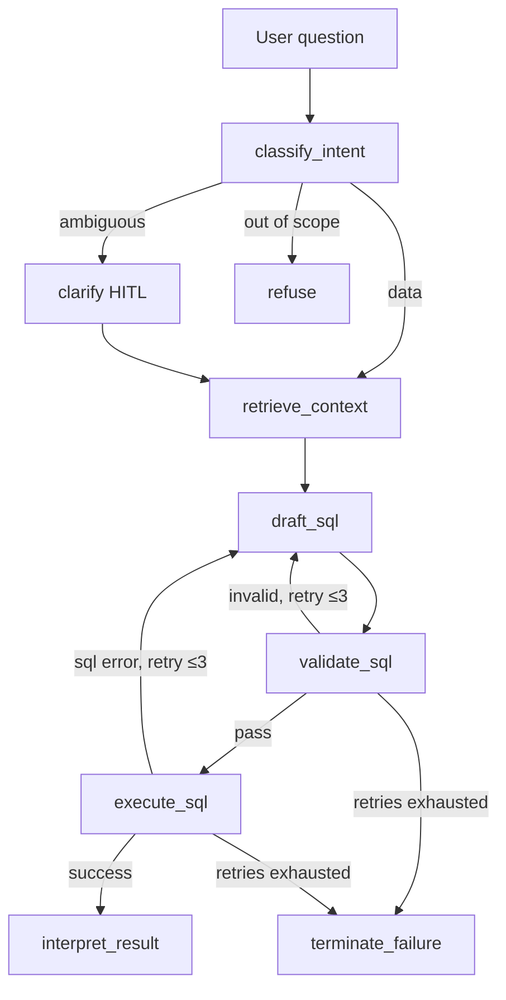

# Voyage BI Copilot

A production-grade text-to-SQL agent for vacation rental operations. Answers
natural-language questions over a synthetic Postgres warehouse and returns
validated SQL, tabular results, and a short written interpretation.

Built as a portfolio piece — the interesting engineering is everything
*around* the LLM call: retrieval over real schemas, safety rails, evals
that catch regressions, observability of agent traces, human-in-the-loop
clarification, and self-correction on errors.

## What it does

```
$ voyage ask "Top 5 markets by revenue last quarter"

Voyage  run a1b2c3d4  →  logs/run-20260418-120301-a1b2c3d4.jsonl
Q: Top 5 markets by revenue last quarter

  ✓ classify_intent   412 ms  (180→32 tok)
  ✓ retrieve_context   88 ms
  ✓ draft_sql          904 ms  (2140→190 tok)
  ✓ validate_sql        11 ms
  ✓ execute_sql         34 ms
  ✓ interpret_result   610 ms  (820→140 tok)

SQL
  SELECT m.name, SUM(r.net_revenue) AS revenue
  FROM warehouse.reservations r
  JOIN warehouse.properties p  ON p.property_id = r.property_id
  JOIN warehouse.markets m     ON m.market_id    = p.market_id
  WHERE r.status = 'confirmed'
    AND r.check_in >= date_trunc('quarter', now()) - interval '3 months'
    AND r.check_in <  date_trunc('quarter', now())
  GROUP BY m.name ORDER BY revenue DESC LIMIT 5;

Results  (5 rows, 34 ms)
  Joshua Tree   $412,300
  Big Bear      $338,910
  Palm Springs  $289,440
  ...

Answer  Joshua Tree led the quarter with $412k in confirmed revenue, 22 %
        ahead of Big Bear in second place.
```

## Architecture

The agent is a LangGraph state machine. One question flows through the
graph; the graph branches to HITL clarification, refuses out-of-scope
requests, and self-corrects on validator or execution errors up to three
times.



Full node-by-node walkthrough lives in [docs/ARCHITECTURE.md](docs/ARCHITECTURE.md).
Three worked demo sessions (happy path, clarification, refusal) are in
[docs/DEMO.md](docs/DEMO.md).

## Tech stack

| Layer              | Choice                        |
|--------------------|-------------------------------|
| Language           | Python 3.12, `uv`             |
| Orchestration      | LangGraph (checkpointed, HITL via `interrupt`) |
| LLM                | Claude via Anthropic SDK + `instructor` for typed outputs |
| Structured outputs | Pydantic v2 on every LLM call |
| Database           | PostgreSQL 16 + `pgvector`    |
| MCP server         | FastMCP — 5 read-only tools   |
| CLI                | Typer + Rich                  |
| Eval harness       | pytest-driven, YAML goldens   |
| Lint / type / test | ruff, mypy --strict, pytest   |
| CI / security      | GitHub Actions + Gitleaks, Bandit, pip-audit, Snyk |

## Quick start

Requires Docker and `uv`.

```bash
cp .env.example .env        # set ANTHROPIC_API_KEY
make setup                  # uv sync + pre-commit
make up                     # postgres + pgvector in docker
make seed                   # load synthetic warehouse (~84 k rows)
make ask q="How many active properties do we have?"
```

From cold checkout to first answer: ~3 minutes.

## Eval results

`make eval` runs 25 golden cases across six categories and writes
`evals/latest.md`. The v0.1 targets below line up with the report produced
by the harness.

| Category          | Count | Target hard-pass |
|-------------------|-------|------------------|
| easy              | 8     | ≥ 80 %           |
| medium            | 8     | ≥ 60 %           |
| hard              | 4     | ≥ 30 %           |
| ambiguous         | 2     | 100 % (clarify)  |
| adversarial       | 2     | 100 % (refuse)   |
| hallucination_trap| 1     | must not invent SQL that errors at execute time |

Grading is three-tier: result-set match (unordered, 1 % numeric tolerance)
→ LLM-judge soft-pass → fail. Clarify/refuse cases are graded by
terminal node, not content.

## Safety

The validator is the contract, not a best-effort layer.

- Parse-tree SELECT-only enforcement via `sqlglot` — substring matching
  is not enough.
- No DDL, DML, `COPY`, `pg_*`, `dblink`, `lo_*`.
- Implicit `LIMIT 1000` injection when missing.
- 10 s statement timeout at session level.
- DB role `bi_copilot_ro` has only `SELECT` on the warehouse schema —
  belt-and-braces defence if validation is somehow bypassed.
- `EXPLAIN` cost check before execute.
- Every rejected query is logged with the full draft and the reason, so
  eval runs surface attempted bypasses.

Full threat model in [CLAUDE.md](CLAUDE.md) under `## DevOps, SDLC, and
security posture`.

## Observability

Every node emits a `Span` to `state.trace` and to
`logs/run-{timestamp}-{run_id}.jsonl`. Fields:
`run_id, node, duration_ms, tokens_in, tokens_out, model, retry_count,
error`. `voyage ask --trace` pretty-prints the trace after the answer.
The format is designed to be a one-exporter hop away from OpenTelemetry
or LangSmith.

## Known tradeoffs (v0.1)

- **Retrieval recall** — top-k is 6 tables. Rare-table questions will
  miss. Self-correction loop helps; it does not solve.
- **Result-set grading** — we match on rows, not query equivalence.
  Correct for a business user; weaker as a query-quality measure.
- **Non-determinism in interpretation** — even at temperature 0,
  wording varies. Graded by LLM-judge, not exact match.
- **Cost estimation** — `EXPLAIN` cost is a Postgres-internal unit,
  not wall-clock. Timeout is the real backstop.
- **One model family tested in evals** — Anthropic only in v0.1;
  other providers are not implemented or validated here.
- **No token streaming** — node-level streaming only; the final
  answer arrives as one block.

## Out of scope for v0.1

SELECT-only (no writes), single-tenant, CLI-only (no web UI), no
LangSmith, no ClickHouse, no cross-tenant row-level security, no
fine-tuning. Each of these is a deliberate cut documented in
[CLAUDE.md](CLAUDE.md).

## Repo layout

Short version:

```
voyage/            agent code (graph, nodes, cli)
server/            MCP warehouse server + SQL validator
scripts/           seed + build_retrieval_index
sql/               schema.sql (warehouse + bi_copilot_ro role)
data/              metrics.yaml (named business metrics)
evals/             golden.yaml + harness + report
tests/             pytest suite (unit + integration markers)
docs/              architecture + demo walkthroughs
```

Full map in [CLAUDE.md](CLAUDE.md).

## License

[MIT](LICENSE).
