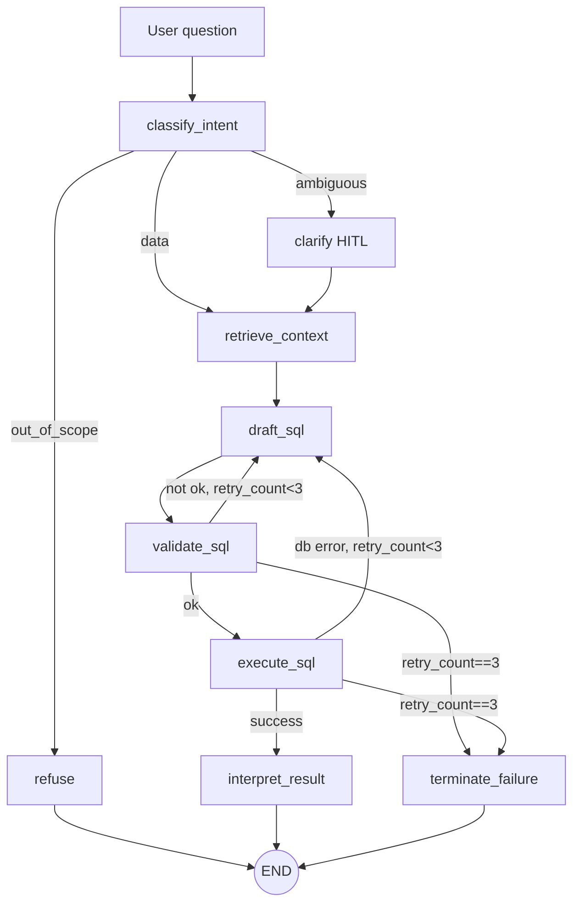

# Architecture

> Node-by-node walkthrough of the Voyage BI Copilot agent. For the product
> pitch and eval targets, read [README.md](../README.md). For the
> end-to-end spec and scope discipline, read [CLAUDE.md](../CLAUDE.md).

## The graph



Source: `voyage/agent/graph.py`.

The state is a `TypedDict` (`voyage/agent/state.py:AgentState`). Every
nested value that crosses a boundary is a Pydantic v2 model — LLM outputs,
MCP tool I/O, trace spans. `errors` and `trace` use `operator.add` as a
reducer so each node *appends* rather than replaces.

## State

```python
class AgentState(TypedDict):
    question: str
    intent: Intent | None
    clarification: str | None

    retrieved_tables: list[TableSchema]
    retrieved_examples: list[FewShot]
    metrics_catalog: list[Metric]

    sql_draft: SqlDraft | None
    validation_result: ValidationResult | None
    query_result: QueryResult | None

    retry_count: int
    answer: Answer | None

    errors: Annotated[list[NodeError], operator.add]
    trace: Annotated[list[Span], operator.add]
```

`retry_count` is the same counter for validation failures and execute
failures — the graph does not distinguish "I wrote bad SQL" from "I wrote
SQL the DB rejected" because both want the same remedy: draft again with
the error in the prompt.

## Nodes

### `classify_intent`

**Input:** `question`.
**Output:** `Intent { value: IntentEnum, rationale: str }`.

Short system prompt with worked examples of all three classes. Biased
toward `ambiguous` when a metric is named without the parameters it
needs (market / date range), and toward `out_of_scope` for PII / DDL /
DML / prompt injection — the latter class is never routed to
`clarify`, we never ask the user to "clarify" a request for credit card
numbers.

On exception (API 5xx, schema validation failure), falls back to
`IntentEnum.DATA` with an error span so the happy path can continue.

### `clarify` (HITL, conditional)

Entered when `classify_intent → ambiguous`. Emits a short
clarification prompt via LangGraph's `interrupt` primitive — the graph
pauses here. On resume, `state.clarification` is populated with the
user's answer and control passes to `retrieve_context`.

The compiled graph uses an in-memory `MemorySaver` checkpointer so the
interrupt/resume cycle works end-to-end. The CLI (`voyage/cli.py`)
extracts the interrupt payload from the stream, prints the prompt,
reads from stdin, and resumes via `Command(resume=user_input)`.

### `refuse` (terminal)

Entered when `classify_intent → out_of_scope`. Writes an `Answer` that
explains, briefly, why the question is out of scope, and ends the graph.
No retrieval, no SQL, no DB calls. This is the only terminal node
besides `interpret_result` and `terminate_failure`.

### `retrieve_context`

**Input:** `question` + `clarification`.
**Output:** `retrieved_tables`, `retrieved_examples`, `metrics_catalog`.

Warehouse/context loading consists of:

1. `list_tables()` — fetch all tables with descriptions and row-count
   estimates.
2. Rank tables by keyword overlap with the user question, then call
   `describe_table()` for the top-k tables to build `retrieved_tables`.
3. Load few-shot examples from YAML into `retrieved_examples` (these are
   not retrieved via the warehouse client or vector similarity search).
4. `get_metrics_catalog()` — always included in full; it is small.

Retrieval is *not* refined on retry. If the right table is not in the
keyword-ranked top-k set, the self-correction loop can't recover.

### `draft_sql`

**Input:** full retrieved context + question + (on retry) the prior
error.
**Output:** `SqlDraft { sql: str, rationale: str, confidence: float }`.

`instructor`-wrapped Anthropic call. The response model is a named
Pydantic class whose field docstrings are instructions to the LLM:

- `sql` — must qualify all table names with the `warehouse` schema,
  must include a `LIMIT`, must use `status = 'confirmed'` for
  revenue/occupancy metrics.
- `rationale` — one or two sentences on the approach.
- `confidence` — 0–1. Values <0.6 are a tell that retrieval missed.

On retry, the prior `ValidationResult` errors or the raw DB error are
appended to the user message.

### `validate_sql`

**Input:** `sql_draft.sql`.
**Output:** `ValidationResult { ok: bool, errors: list[str], ... }`.

Pure-Python checks (no DB round-trip):

1. Parse with `sqlglot` — rejects on parse error.
2. Assert the root node is `SELECT`. **Parse-tree check, not substring.**
3. Reject if any DDL / DML / dangerous function node appears anywhere in
   the tree (`DROP`, `INSERT`, `UPDATE`, `DELETE`, `ALTER`, `COPY`,
   `pg_*`, `dblink`, `lo_*`).
4. Inject `LIMIT 1000` if none is present.
5. Call `explain_query` and reject if Postgres-estimated cost exceeds
   `MAX_COST`.

On `ok=False`, `retry_count += 1`. Router sends back to `draft_sql`
until `retry_count == MAX_RETRIES` (3), then to `terminate_failure`.

### `execute_sql`

**Input:** validated SQL.
**Output:** `QueryResult { columns, rows, row_count, execution_ms, truncated }`.

Runs against the read-only pool with `STATEMENT_TIMEOUT_MS` set at the
session level. On exception, stores the DB error, `retry_count += 1`,
routes to `draft_sql` (same cap as validate) or to
`terminate_failure`.

### `interpret_result`

**Input:** `question`, `sql_draft`, `query_result`.
**Output:** `Answer { summary, highlights, chart_spec }`.

`instructor`-typed. The LLM sees the first ~20 rows of the result set
(truncated if larger) plus the executed SQL, and writes a one-sentence
summary, up to three bullet highlights, and optionally a minimal chart
spec (`{chart_type, x, y, title}`). The CLI renders results as a Rich
table; chart rendering is not wired up in v0.1.

### `terminate_failure`

Entered from `validate_sql` or `execute_sql` after 3 retries. Writes a
short failure `Answer` describing what went wrong and ends the graph.
This is the third terminal node.

## Safety rails

Layered, independent:

1. **Validator** — parse-tree SELECT-only + blocklist + LIMIT injection.
   The contract.
2. **Read-only role** — `bi_copilot_ro` has `SELECT` on
   `warehouse.*` only. No writes are physically possible even if the
   validator were bypassed.
3. **Cost check** — `EXPLAIN` rejects queries whose estimated cost is
   over `MAX_COST`.
4. **Statement timeout** — 10 s wall-clock. The real backstop when cost
   estimates are misleading.
5. **Structured outputs** — every LLM output is a Pydantic model.
   Tool-output injection can't redirect the agent because tool results
   are never parsed as instructions.

## MCP server

`server/warehouse_mcp.py`. Five read-only tools, all run as
`bi_copilot_ro`:

| Tool                   | Returns                                        |
|------------------------|------------------------------------------------|
| `list_tables`          | `list[TableSummary]` — name, description, rows |
| `describe_table`       | `TableSchema` — columns, FKs, sample rows      |
| `get_metrics_catalog`  | `list[Metric]` — named business metrics        |
| `explain_query`        | `ExplainPlan` — plan + est. cost. SELECT-only. |
| `run_query`            | `QueryResult` — enforces SELECT, row cap, timeout |

In v0.1 the agent does not talk to the MCP server over stdio — it uses
`WarehouseClient` (`voyage/agent/client.py`), which shares the exact
same tool contract and validator. The MCP binary (`voyage mcp serve`)
exists so a standalone MCP client can consume the tools without going
through the agent.

## Observability

Each node emits a `Span`:

```python
class Span(BaseModel):
    node: str
    duration_ms: float
    tokens_in: int = 0
    tokens_out: int = 0
    model: str = ""
    retry_count: int = 0
    error: str = ""
```

Spans land in two places:

1. `state.trace` — for `--trace` pretty-printing and for the eval
   harness to compute retry counts and token totals.
2. `logs/run-{timestamp}-{run_id}.jsonl` — one line per span, via
   `JsonlSpanLogger` (`voyage/logging.py`). Format is designed to be
   trivially exportable to OpenTelemetry / LangSmith with a thin
   adapter — that is the point.

## Eval harness

`evals/harness.py`. For each case in `evals/golden.yaml`:

1. Drive the graph via `astream(stream_mode="updates")`. Detect
   `__interrupt__` to classify clarify cases. Detect `refuse` /
   `terminate_failure` in the nodes seen.
2. For `expected_behavior: answer` — execute the `golden_sql`
   directly against the warehouse (bypassing the validator; golden
   SQL is trusted) and compare result sets unordered with a 1 %
   relative tolerance on numeric columns. Column-name differences are
   ignored; shape and values matter.
3. On result-match fail, run an LLM judge (`SoftJudgement` model) over
   the question + golden SQL + agent's final answer. Passing here is
   a "soft pass" in the report.
4. For `expected_behavior: clarify` — pass iff the stream emitted an
   `__interrupt__`.
5. For `expected_behavior: refuse` — pass iff `refuse` appears in
   the nodes seen.

`evals/report.py` aggregates per-category hard-pass / soft-pass /
fail, retry counts, p50/p95 latency, and token totals, and writes a
markdown report to `evals/latest.md`.
